# Experiments

The various experiments done with the GMM with EM are documented here. The data was generated artificially with

- Means picked from a Uniform Distribution
- Variances / Covariances picked from a Uniform Distribution
- Proportions selected randomly such that they add to 1

> NOTE: A Covariance matrix needs to be positive semi-definite. To ensure that, we first generate a random matrix, and then multiply it by its transpose.

Since we have the ground truth, i.e. the actual clustering, we can compare K-Means with GMM using Adjusted Rand Index/Score (ARI or ARS).

## (1) Univariate, Fixed Variance

- 1000 runs
- N = 1000 points in each run
- K = 3 clusters
- Univariate
- Variance fixed to 1. So, the M step only optimizes mean and proportions.

GMM with EM was done in 2 modes:

1. Best of 10 Random Initializations [Best of the 10 Log-Likelihoods obtained from each Model]
2. K-Means Initialization

GMM was compared with standard K-Means.

### Counts

- **GMM with Best of 10 Random Inits** performed better or equal to **standard K-Means** around **82%** of the time.
- **GMM with K-Means Init** performed better or equal to **standard K-Means** around **89.4%** of the time

However, these simple counts can be misleading, as the comparison is a _better or equal to_. This is not a strict inequality, to account for the fact that there are runs where both GMM and K-Means give a perfect ARS = 1.

Box Plots and Histograms give a better idea.

### ARS Histogram

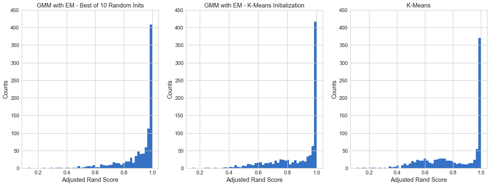

It looks like GMM is performing slightly better. To get the extent of how much, we can do box plots.

### ARS Difference Box Plots

We plot the difference in ARS for various pairs.

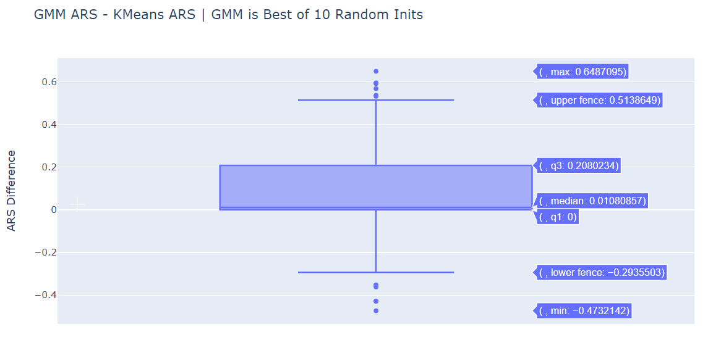

---

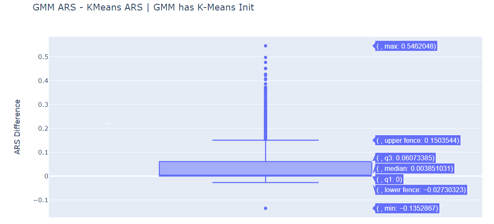

The median is positive for (GMM ARS - KMeans ARS) for both initialization methods. GMM does perform better than standard K-Means.

---

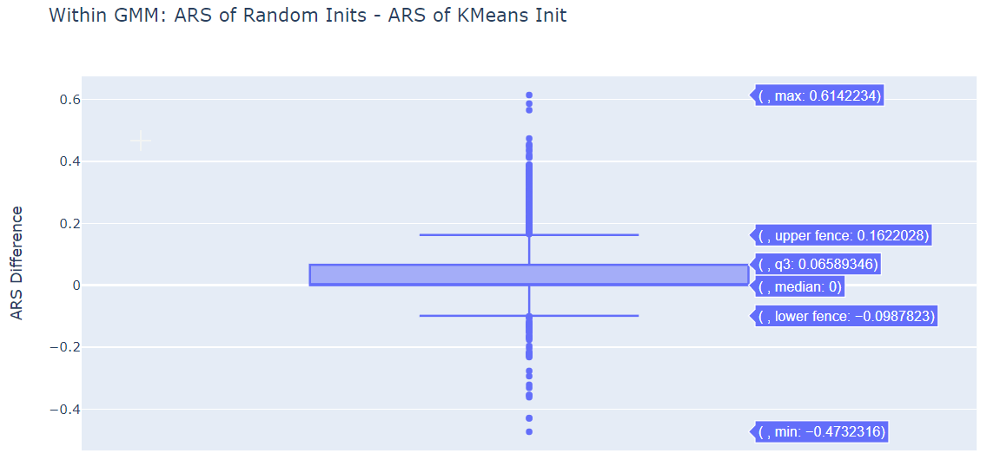

Within the GMM, both Random Initialization and K-Means Initialization seem to be more or less equivalently.

---

## (2) 2 clusters with same mean but different variances

- 1000 runs
- N = 1000 points in each run
- K = 2 clusters with same mean but different variances
- Univariate

This is a situation in which K-Means is expected to perform poorly, as the centers of both the clusters are at the same point.

GMM with EM was done in 2 modes:

1. Best of 10 Random Initializations [Best of the 10 Log-Likelihoods obtained from each Model]
2. K-Means Initialization

GMM was compared with standard K-Means.

### Counts

- **GMM with Best of 10 Random Inits** performed better or equal to **standard K-Means** around **69.3%** of the time.
- **GMM with K-Means Init** performed better or equal to **standard K-Means** around **64%** of the time

As mentioned in the first experiment, take these counts with a grain of salt. Box Plots and Histograms give a better idea.

### ARS Histogram

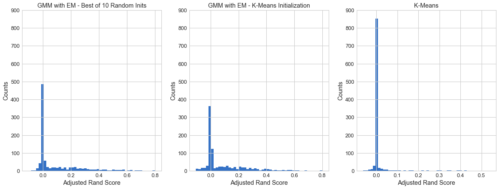

GMM is definitely performing better than the standard K-Means, in both of its initialization methods.

### ARS vs Difference of Std Devs

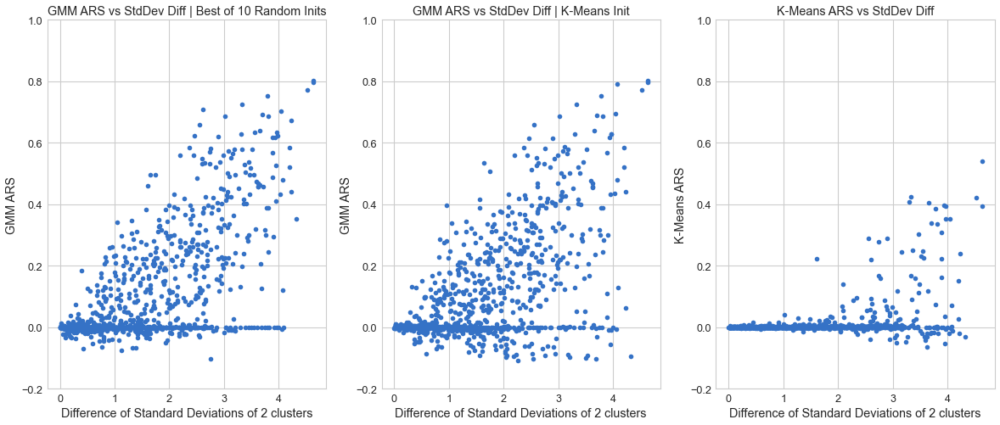

In the case where the difference of the standard deviations of the two clusters is more, GMM performs rather well, and K-Means fails as expected.

### ARS Difference Box Plots

We plot the difference in ARS for various pairs.

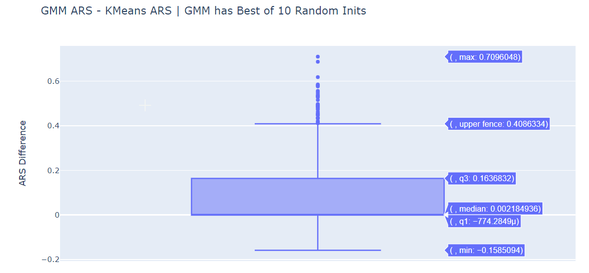

---

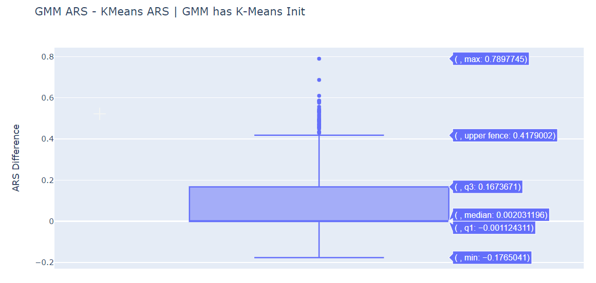

The median is positive for (GMM ARS - KMeans ARS) for both initialization methods. GMM does perform better than standard K-Means.

---

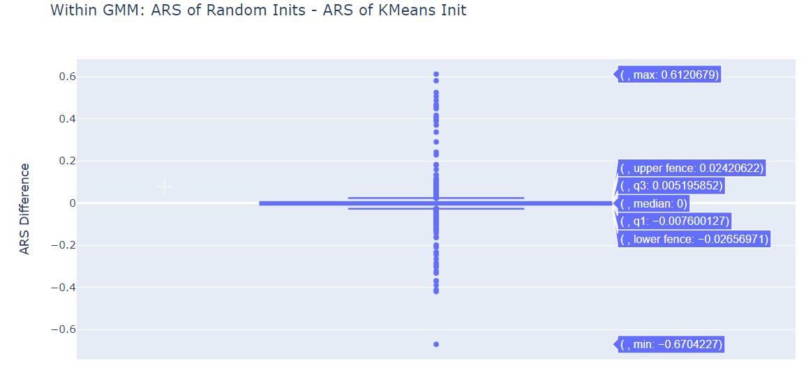

Within the GMM, both Random Initialization and K-Means Initialization seem to be more or less equivalently.

---

## (3) Multivariate

- 1000 runs
- N = 1000 points in each run
- D = 3 dimensional observations
- K = 5 clusters

GMM with EM was done in 2 modes:

1. Best of 10 Random Initializations [Best of the 10 Log-Likelihoods obtained from each Model]
2. K-Means Initialization

GMM was compared with standard K-Means. We have moved from 1 to 3 dimensions here.

### Counts

- **GMM with Best of 10 Random Inits** performed better or equal to **standard K-Means** around **99.8%** of the time.
- **GMM with K-Means Init** performed better or equal to **standard K-Means** around **99.7%** of the time
- Within the GMM itself, **Best of 10 Random Inits** performed better or equal to **K-Means Init** around **90.9** of the time.

The counts here present a very significant difference, compared to the last two experiments. Both the GMM modes outperform standard K-Means in almost all of the cases. The 2 or 3 runs where they didn't, turn out to be cases where there are clusters with just 1-2 points (leading to an almost non-existent actual cluster). This likely led to Covariance Matrices for that particular Cluster turning singular, ending the run with an ARS = 0.

Even with the GMM itself, Random Initialization outperforms K-Means Initialization. K-Means Initialization means we are starting from the result of the standard K-Means, which isn't very good in itself. Starting from many random places allows our EM algorithm to converge to better solutions.

### ARS Histogram

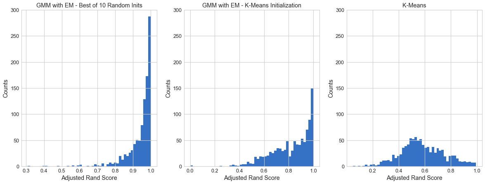

GMM is clearly performing better. There's more instances of ARS being closer to 1 than the standard K-Means.

Even within GMM, the Best of 10 Random Inits method seems to be performing better than the K-Means Init (as is further confirmed by the ARS Difference Box Plots).

### ARS Difference Box Plots

We plot the difference in ARS for various pairs.

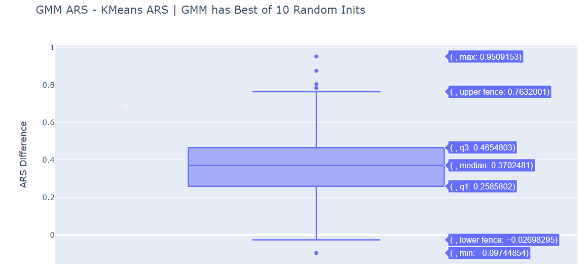

---

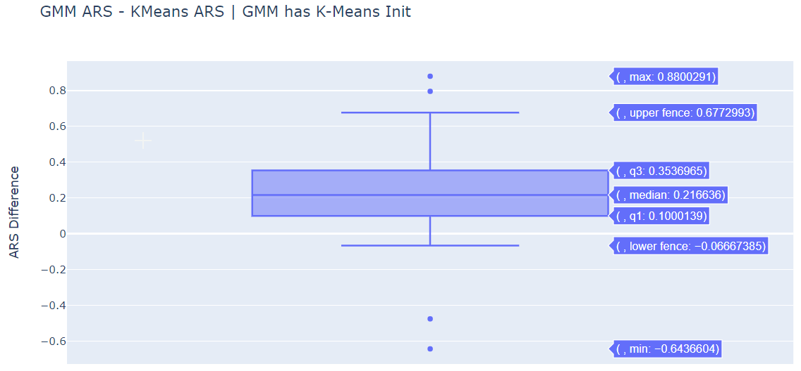

The median is significantly positive for (GMM ARS - KMeans ARS) for both initialization methods. GMM does perform better than standard K-Means.

---

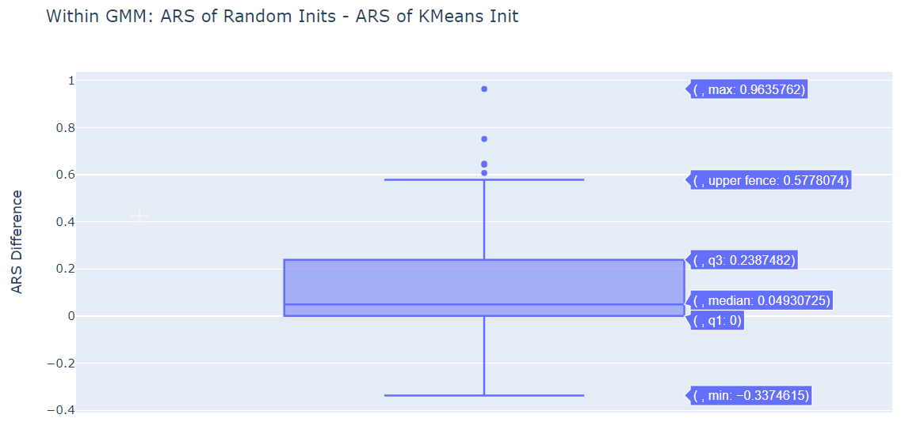

Within the GMM, the Best of 10 Random Initializations Method is performing better than the K-Means Initialization.

